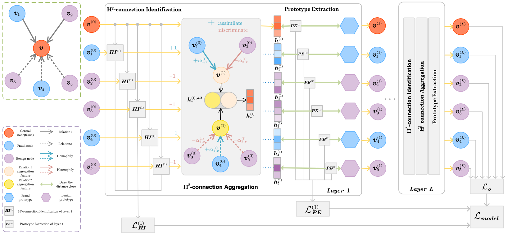

# H2-FDetector
This is the PyTorch implementation of the Graph Neural Network-based Fraud Detector with Homophilic and Heterophilic Interactions (H2-FDetector), as described in our paper:

Fengzhao Shi, Yanan Cao, Yanmin Shang, Yuchen Zhou, Chuan Zhou, Jia Wu, [H2-FDetector: A GNN-based Fraud Detector with Homophilic and Heterophilic Connections](https://dl.acm.org/doi/10.1145/3485447.3512195) (WWW'22)



# Dependencies
- [pytorch](https://www.dgl.ai/) >= 3.9.12
- [DGL](https://pytorch.org/) >= 0.8.0 
# Usage
- ```src/```: includes all code scripts.
- ```data/```: includes original datasets:
    - ```YelpChi.zip```: The original dataset of YelpChi, which contains hotel and restaurant reviews filtered (spam) and recom- mended (legitimate) by Yelp.
    - ```Amazon.zip```: The original dataset of Amazon, which contains product reviews under the Musical Instruments category.
- ```config```: includes the setting of parameters for two datasets.
    - ```yelp.yaml```: The general parameters of YelpChi.
    - ```amazon.yaml```: The general parameters of Amazon.
# Model Training
We take YelpChi as an example to illustrate the usage of repository.
```
# Unzip the dataset
upzip ./data/YelpChi.zip ./data/

# Move to src/
cd src/

# Convert the original dataset to dgl graph
# The generated dgl graph does not contains the features and graph structure, but also extracts the edge label.
python data_preprocess.py --dataset yelp

# Train and test the dataset
# If you want to change the parameters in training process, you can modify the corresponding yaml file in config.
python train.py --dataset yelp 
```
# Citation
Please cite the following paper if you use this code in your work:
```
@inproceedings{h2fdetector_webconf22,
title = {H2-FDetector: A GNN-based Fraud Detector with Homophilic and Heterophilic Connections},
author = {Shi, Fengzhao and Cao, Yanan and Shang, Yanmin and Zhou, Yuchen and Zhou, Chuan and Wu, Jia},
booktitle = {Proceedings of the ACM Web Conference 2022 (TheWebConf)},
pages = {1486--1494},
year = {2022}
}
```
If you have any questions about the paper or the code, please feel free to create an issue or contact Fengzhao Shi <shifengzhao@iie.ac.cn>. Sometimes I may not reply very quickly because of the engaged matters, but I will do it asap when I am free :)